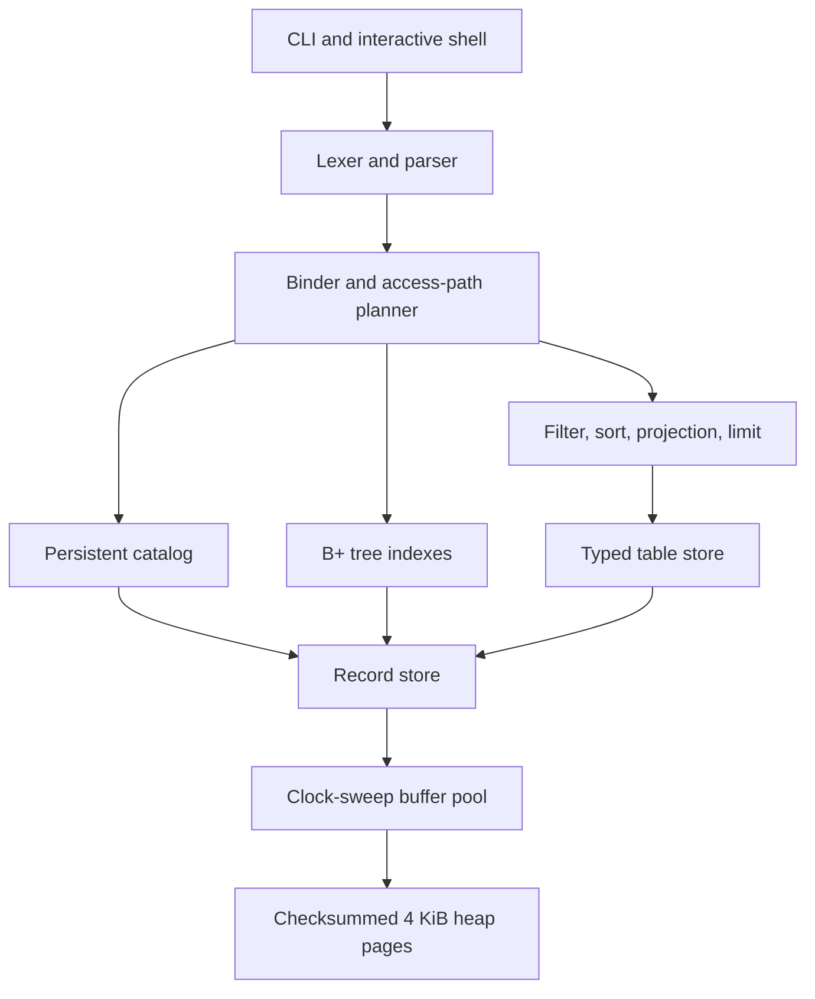

# Three-minute portfolio demo

This walkthrough demonstrates persistence, typed SQL execution, index
construction, and non-executing access-path inspection. Use a new database path
so every step is reproducible.

## Architecture at a glance



The important boundary is that `EXPLAIN SELECT` stops after binding and access
path selection. It does not create a table cursor or load matching index rows.

## 0:00–0:40 — Build and verify

```bash
make check
```

Explain that the command compiles with warnings treated as errors, runs 48
unit tests, exercises the complete CLI, and validates the benchmark contract.

## 0:40–1:20 — Persist typed rows

```bash
./build/pageforge demo.db init
./build/pageforge demo.db create-table people id:int name:text active:bool
./build/pageforge demo.db insert people 1 Ada true
./build/pageforge demo.db insert people 2 Grace true
./build/pageforge demo.db insert people 3 Linus false
./build/pageforge demo.db query \
  "SELECT name FROM people WHERE active = TRUE ORDER BY id DESC;"
```

Each command opens the same heap in a new process, so the output demonstrates
on-disk catalog and row persistence rather than in-memory state.

## 1:20–2:15 — Show the planner changing

```bash
./build/pageforge demo.db query \
  "EXPLAIN SELECT name FROM people WHERE id = 2;"
./build/pageforge demo.db create-index people_id_idx people id
./build/pageforge demo.db query \
  "EXPLAIN SELECT name FROM people WHERE id = 2;"
./build/pageforge demo.db query \
  "SELECT name FROM people WHERE id = 2;"
```

Expected planner output:

```text
TABLE_SCAN table=people predicates=1 sort=false limit=none
INDEX_LOOKUP table=people index=people_id_idx key=2 predicates=1 sort=false limit=none
```

The index command backfills rows that already exist, then registers ownership
in the catalog. Later inserts and deletes maintain the tree automatically.

## 2:15–3:00 — Discuss engineering tradeoffs

- Slotted pages preserve record IDs while compacting variable-length payloads.
- The buffer pool uses clock-sweep eviction and RAII pin guards.
- Equality predicates can use a height-two B+ tree; ranges still scan because
  range-aware planning and recursive internal splits are future work.
- The insertion-page hint improved one controlled 1,000-row development run
  from 784,030 microseconds to a 70,139-microsecond median after the change.
- Index construction is single-threaded and non-transactional. Failed builds
  can leave unreachable internal records until recovery support exists.
- Sorting is stable but blocking, and there is no write-ahead log or isolation.

## Defensible résumé bullets

- Built a C++20 relational database engine with checksummed slotted pages,
  clock-sweep buffering, typed catalogs and tuples, streaming SQL operators,
  and persistent B+ tree indexes; verified by 48 unit tests plus CLI and
  benchmark integration checks.
- Added query-plan introspection and existing-row index construction, then
  optimized append-heavy record placement from 784 ms to a 70 ms median for a
  controlled 1,000-row workload while preserving wraparound free-space reuse.

Only use the measured performance bullet with its 1,000-row scope. Do not
describe PageForge as transactional, concurrent, crash-safe, or production
ready.
